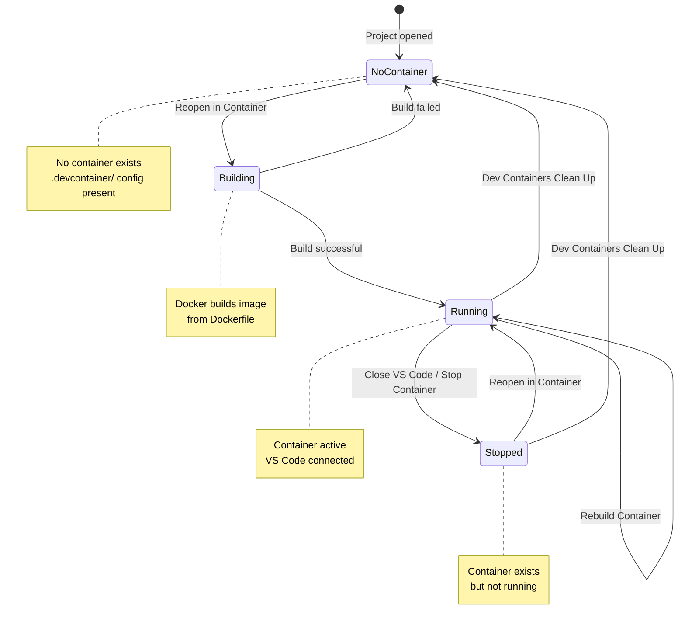
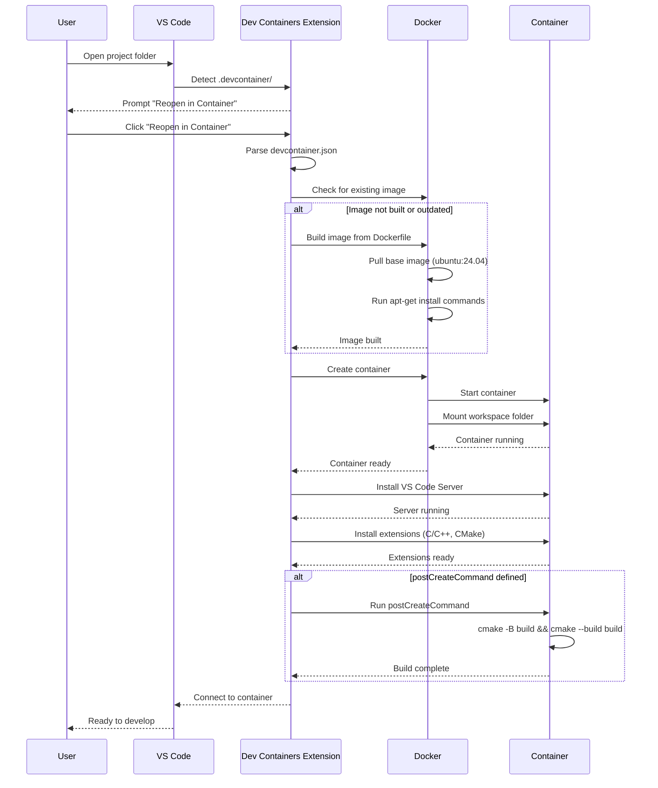
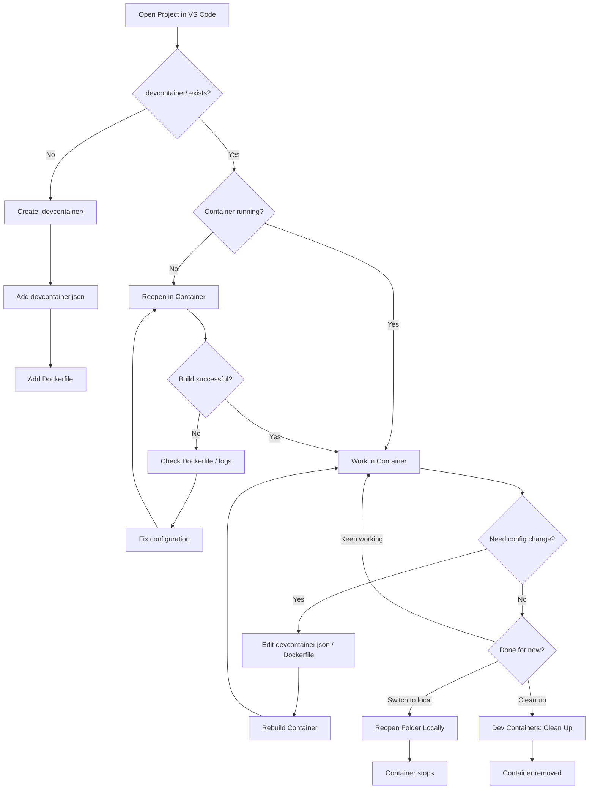
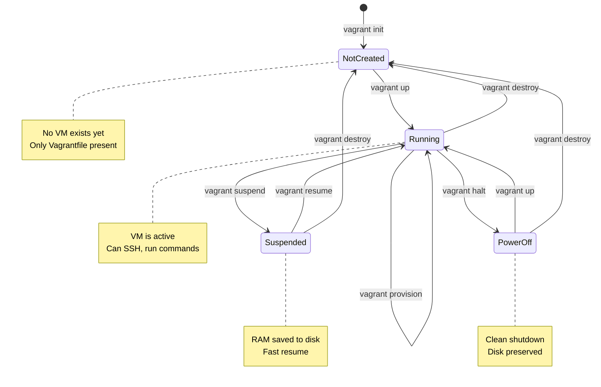
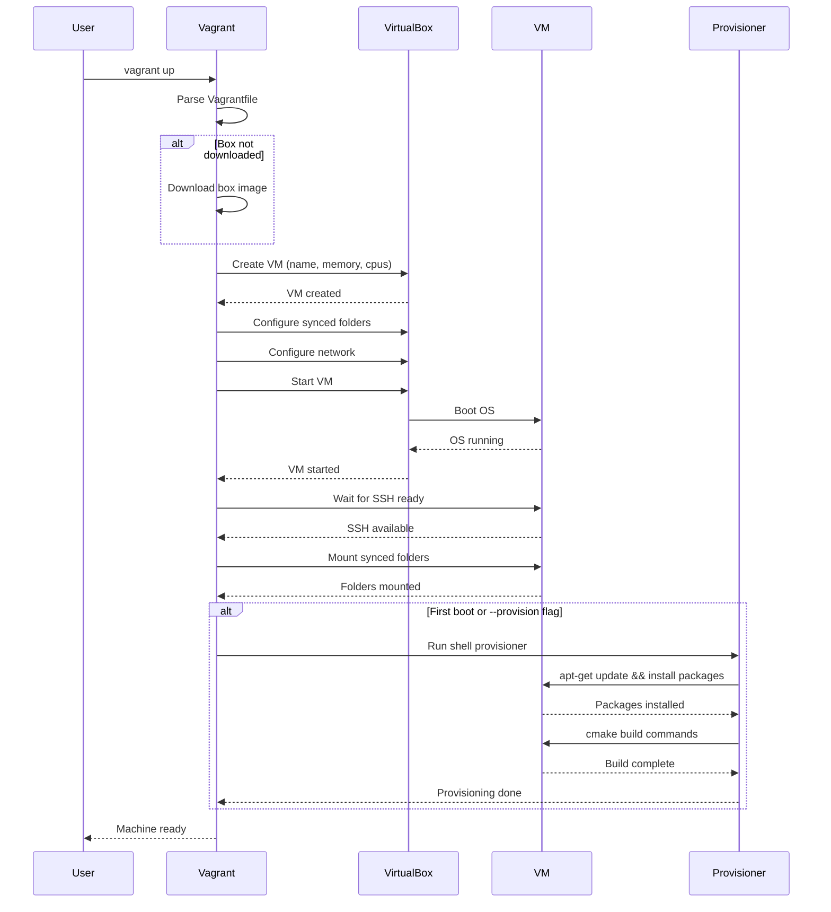
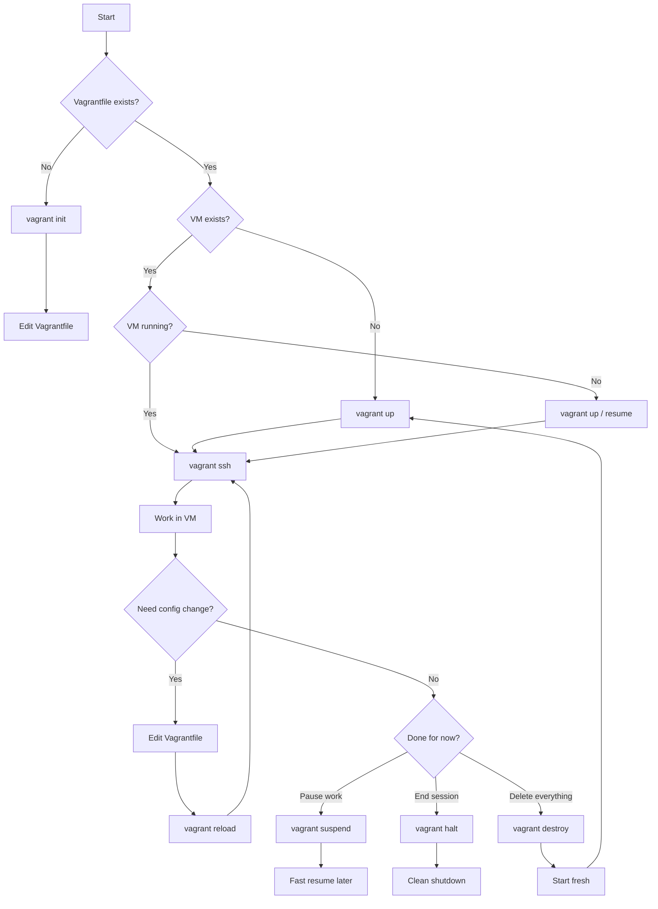

# sample-c

C Sample for various isolation methods (containers, VMs).

## Overview

This project demonstrates how to set up a C development environment using different isolation methods:
- **Dev Containers** (Docker) - lightweight containerized development
- **Vagrant** (VirtualBox VM) - full virtual machine isolation

### Isolation Levels

| Environment | Isolation Level | Details |
|-------------|-----------------|---------|
| **DevContainer** | Medium | Runs in a Docker container, shares the host kernel, file system is isolated but mounts your project folder |
| **Vagrant/VirtualBox** | High | Full VM with its own kernel, hardware virtualization, stronger isolation from the host |

> **Note:** Both setups mount/sync your project directory into the guest environment for convenience. For true isolation (e.g., running untrusted code), you would need to remove the volume mount / synced folder and copy files instead.

## Prerequisites

### For Dev Containers
- [Docker](https://www.docker.com/get-started) installed and running
- [VS Code](https://code.visualstudio.com/) with the [Dev Containers extension](https://marketplace.visualstudio.com/items?itemName=ms-vscode-remote.remote-containers)

### For Vagrant
- [VirtualBox](https://www.virtualbox.org/)
- [Vagrant](https://www.vagrantup.com/)

## Project Structure

```
.
├── .devcontainer/
│   ├── devcontainer.json    # Dev container configuration
│   └── Dockerfile           # Ubuntu 24.04 based image
├── .vscode/                 # VS Code settings
├── CMakeLists.txt           # CMake build configuration
├── main.c                   # Main source file
├── hello.h.in               # Header template for version info
├── Vagrantfile              # Vagrant VM configuration
└── README.md
```

## Running the project

Clone the repository and open it in VS Code:

```sh
git clone https://github.com/s-celles/sample-c-devcontainer-vagrant.git
cd sample-c-devcontainer-vagrant
code .
```

### Dev Container (Docker)


1. Open the project in VS Code
2. When prompted, click "Reopen in Container" or use the command palette (`Ctrl+Shift+P`) and select "Dev Containers: Reopen in Container"
3. Wait for the container to build (first time may take a few minutes)

The container automatically runs cmake and builds the project on startup.

#### Manual build

Open the terminal in VS Code (inside container) via `Terminal > New Terminal` (`Ctrl+Shift+``):

**Using CMake (recommended):**
```sh
cmake -B build -S .
cmake --build build
./build/HelloWorld
```

**Using GCC directly:**
```sh
gcc main.c -o HelloWorld
./HelloWorld
```

Or just press the *Run Code* button found in the top right of the editor panel.

#### Dev Container Features

- **Base image:** Ubuntu 24.04 LTS (Noble Numbat)
- **Installed tools:** gcc, g++, cmake, git, curl
- **VS Code extensions:** C/C++ Extension Pack, CMake Tools

#### Container Lifecycle

The following diagram shows all possible container states and how to transition between them:



#### Dev Container Startup Sequence

What happens when you select "Reopen in Container":



#### Dev Container Development Workflow

Decision tree for common Dev Container operations:



#### Docker Commands Reference

| Command | Description |
|---------|-------------|
| `docker ps` | List running containers |
| `docker ps -a` | List all containers (including stopped) |
| `docker images` | List Docker images |
| `docker system prune` | Remove unused containers, networks, images |
| `docker logs <container>` | View container logs |

### Vagrant (VirtualBox VM)

1. Start the virtual machine:
```sh
vagrant up
```

2. SSH into the VM:
```sh
vagrant ssh
```

3. Navigate to the project and run the executable:
```sh
cd /home/vagrant/project
./build/HelloWorld
```

The VM automatically builds the project during provisioning.

#### Manual build (inside VM)

```sh
cd /home/vagrant/project
cmake -B build -S .
cmake --build build
./build/HelloWorld
```

#### Vagrant Commands

| Command | Description |
|---------|-------------|
| `vagrant up` | Start and provision the VM |
| `vagrant ssh` | Connect to the VM via SSH |
| `vagrant halt` | Stop the VM |
| `vagrant destroy` | Delete the VM |
| `vagrant reload` | Restart the VM |
| `vagrant provision` | Re-run provisioning scripts |

#### VM Lifecycle

The following diagram shows all possible VM states and the commands to transition between them:



#### Vagrant Up Sequence

What happens when you run `vagrant up`:



#### Development Workflow

Decision tree for common Vagrant operations:



#### Vagrant Features

- **Base box:** Ubuntu 24.04 LTS (Noble Numbat)
- **Memory:** 2 GB RAM
- **CPUs:** 2 cores
- **Synced folder:** Project mounted at `/home/vagrant/project`
- **Installed tools:** gcc, g++, cmake, git, curl

## License

This project is licensed under the MIT License - see the [LICENSE](LICENSE) file for details.

## Want to contribute?

Feel free to open a PR with any suggestions for this test project!
