# Git & GitHub Development Workflows

A visual guide to the most popular Git branching strategies and development workflows.

---

## 1. Git Flow

The original branching model introduced by Vincent Driessen in 2010. It defines a strict branching structure designed around project releases, making it ideal for software with scheduled release cycles.

**Key branches:**
- `main` — Production-ready code, tagged with version numbers
- `develop` — Integration branch for features
- `feature/*` — New features, branched from develop
- `release/*` — Preparation for a new release
- `hotfix/*` — Emergency fixes for production


**Best for:** Projects with scheduled releases, multiple versions in production, or teams requiring strict release management.

---

## 2. GitHub Flow

A lightweight, branch-based workflow that supports teams and projects deploying regularly. There's only one rule: anything in `main` is deployable.

**Principles:**
- `main` is always deployable
- Create descriptive branches for new work
- Open a Pull Request for discussion and review
- Deploy immediately after merging


**Best for:** Web applications, SaaS products, and teams practicing continuous deployment.

---

## 3. Trunk-Based Development

A source-control branching model where developers collaborate on code in a single branch called "trunk" (or `main`), resisting the urge to create long-lived feature branches.

**Key practices:**
- Short-lived feature branches (ideally < 1 day)
- Direct commits to trunk for small changes
- Feature flags for incomplete features
- Release branches only for cherry-picking fixes


**Best for:** High-performing teams, CI/CD environments, and organizations prioritizing rapid iteration.

---

## 4. GitLab Flow (Environment Branches)

Combines feature-driven development with environment branches for deployment. It provides a clear path from development through staging to production.

**Environment branches:**
- `main` — Latest development code
- `pre-production` — Staging environment
- `production` — Live environment


**Best for:** Teams needing multiple deployment environments with controlled promotion between stages.

---

## 5. Forking Workflow

The standard workflow for open source projects. Contributors fork the repository, make changes in their own copy, and submit pull requests to the upstream repository.


**Best for:** Open source projects, external contributions, and maintaining a clean upstream repository.

---

## 6. Pull Request Lifecycle

Regardless of the branching strategy, pull requests follow a similar lifecycle from creation to deployment.

```mermaid
---
title: Pull Request Lifecycle
---
flowchart LR
    subgraph Development
        A[📝 Create Branch] --> B[💻 Write Code]
        B --> C[✅ Run Tests Locally]
        C --> D[📤 Push to Remote]
    end
    
    subgraph Review["Code Review"]
        D --> E[🔀 Open PR]
        E --> F{CI/CD Checks}
        F -->|Pass| G[👀 Request Review]
        F -->|Fail| B
        G --> H{Reviewer Feedback}
        H -->|Changes Requested| B
        H -->|Approved| I[✅ Approved]
    end
    
    subgraph Merge
        I --> J{Merge Strategy}
        J -->|Squash| K[Squash & Merge]
        J -->|Rebase| L[Rebase & Merge]
        J -->|Merge Commit| M[Create Merge Commit]
        K --> N[🗑️ Delete Branch]
        L --> N
        M --> N
        N --> O[🚀 Deploy]
    end
    
    style A fill:#bbdefb
    style E fill:#fff9c4
    style I fill:#c8e6c9
    style O fill:#ffccbc
```



---

## 7. Choosing the Right Workflow

Use this decision tree to select the workflow that best fits your team and project.

```mermaid
---
title: Git Workflow Selection Guide
---
flowchart TD
    START([🤔 Choose a Git Workflow]) --> Q1{Team Size?}
    
    Q1 -->|Solo / Small| Q2{Release Cadence?}
    Q1 -->|Large / Enterprise| Q3{Open Source?}
    
    Q2 -->|Continuous| GHF[✅ GitHub Flow]
    Q2 -->|Scheduled| Q4{Complex Releases?}
    
    Q3 -->|Yes| FORK[✅ Forking Workflow]
    Q3 -->|No| Q5{Multiple Environments?}
    
    Q4 -->|Yes| GF[✅ Git Flow]
    Q4 -->|No| TBD[✅ Trunk-Based]
    
    Q5 -->|Yes| GLF[✅ GitLab Flow]
    Q5 -->|No| GF
    
    style GHF fill:#c8e6c9,stroke:#2e7d32
    style GF fill:#bbdefb,stroke:#1565c0
    style TBD fill:#fff9c4,stroke:#f9a825
    style GLF fill:#ffccbc,stroke:#d84315
    style FORK fill:#e1bee7,stroke:#7b1fa2
    style START fill:#f5f5f5,stroke:#424242
```



---

## Quick Comparison

| Workflow | Complexity | Best For | Release Style |
|----------|------------|----------|---------------|
| **GitHub Flow** | Low | Web apps, SaaS | Continuous |
| **Git Flow** | High | Versioned software | Scheduled |
| **Trunk-Based** | Low | High-velocity teams | Continuous |
| **GitLab Flow** | Medium | Multi-environment | Staged |
| **Forking** | Medium | Open source | Contributor-driven |

---

## Essential Git Commands by Workflow

### GitHub Flow
```bash
git checkout -b feature/my-feature
# ... make changes ...
git add . && git commit -m "Add feature"
git push -u origin feature/my-feature
# Open PR on GitHub, merge, then:
git checkout main && git pull
git branch -d feature/my-feature
```

### Git Flow
```bash
# Start a feature
git checkout develop
git checkout -b feature/my-feature

# Finish a feature
git checkout develop
git merge feature/my-feature

# Create a release
git checkout -b release/1.0 develop
# ... bump version, fix bugs ...
git checkout main && git merge release/1.0
git tag -a v1.0.0 -m "Release 1.0.0"
git checkout develop && git merge release/1.0
```

### Forking Workflow
```bash
# Setup
git clone https://github.com/YOUR-USERNAME/repo.git
git remote add upstream https://github.com/ORIGINAL/repo.git

# Stay updated
git fetch upstream
git checkout main
git merge upstream/main

# Contribute
git checkout -b feature/contribution
# ... make changes ...
git push origin feature/contribution
# Open PR to upstream
```

---

*Generated with Mermaid diagrams. Render in GitHub, GitLab, VS Code, or any Mermaid-compatible viewer.*
