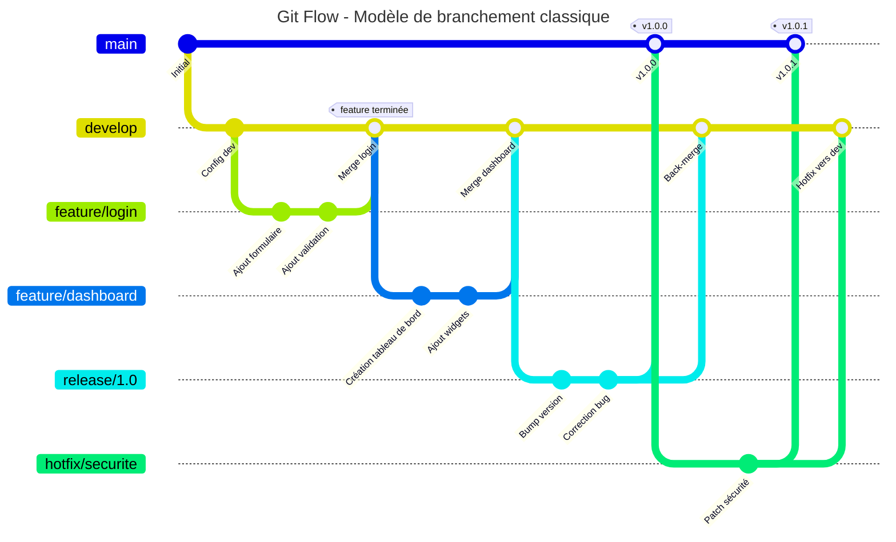
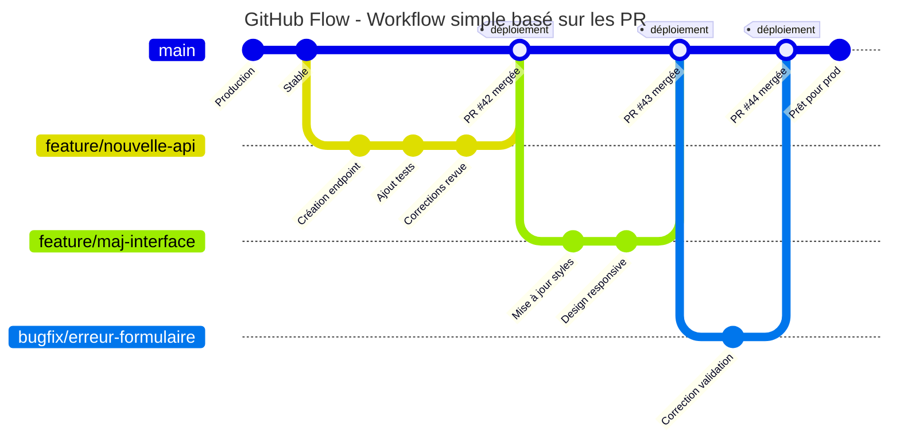
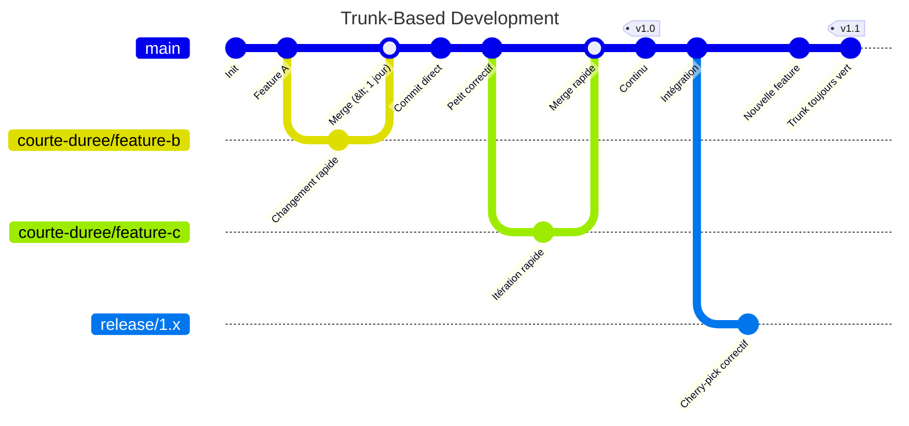
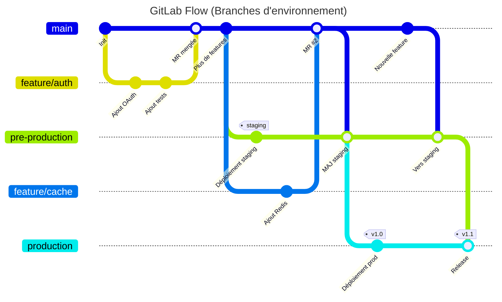
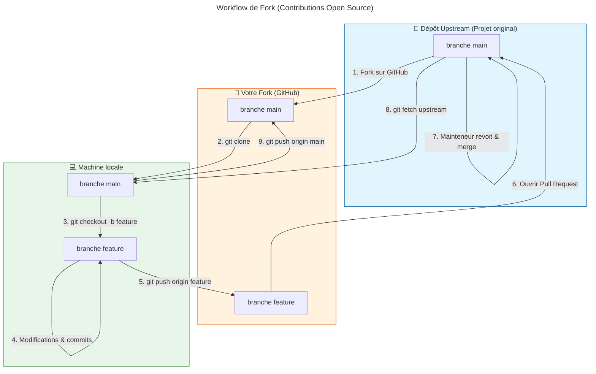
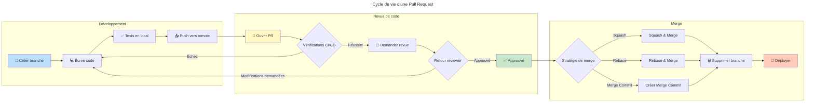
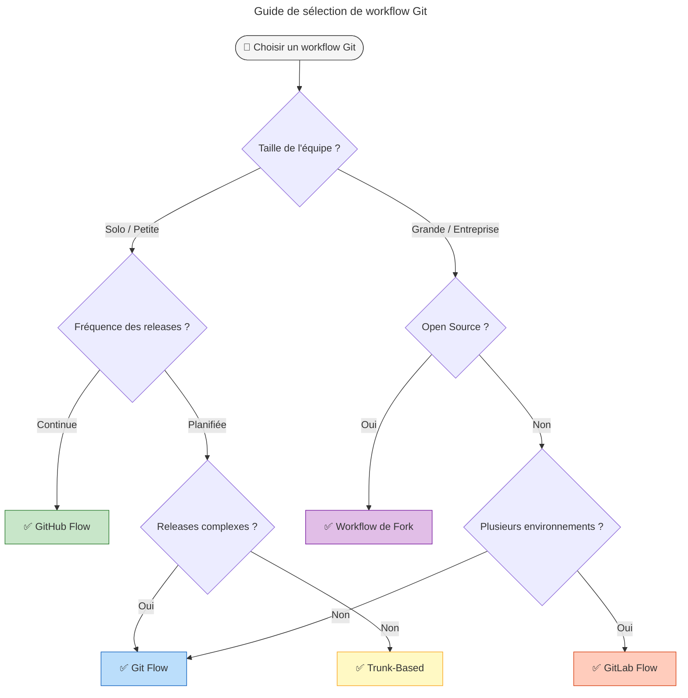

# Workflows de développement Git & GitHub

Un guide visuel des stratégies de branchement Git et workflows de développement les plus populaires.

---

## 1. Git Flow

Le modèle de branchement original introduit par Vincent Driessen en 2010. Il définit une structure de branches stricte conçue autour des releases du projet, idéal pour les logiciels avec des cycles de release planifiés.

**Branches principales :**
- `main` — Code prêt pour la production, tagué avec les numéros de version
- `develop` — Branche d'intégration pour les fonctionnalités
- `feature/*` — Nouvelles fonctionnalités, créées depuis develop
- `release/*` — Préparation d'une nouvelle release
- `hotfix/*` — Correctifs urgents pour la production



**Idéal pour :** Projets avec releases planifiées, plusieurs versions en production, ou équipes nécessitant une gestion stricte des releases.

---

## 2. GitHub Flow

Un workflow léger basé sur les branches qui convient aux équipes et projets déployant régulièrement. Il n'y a qu'une seule règle : tout ce qui est dans `main` est déployable.

**Principes :**
- `main` est toujours déployable
- Créer des branches descriptives pour chaque travail
- Ouvrir une Pull Request pour discussion et revue
- Déployer immédiatement après le merge



**Idéal pour :** Applications web, produits SaaS, et équipes pratiquant le déploiement continu.

---

## 3. Trunk-Based Development (Développement basé sur le tronc)

Un modèle de contrôle de source où les développeurs collaborent sur le code dans une seule branche appelée "trunk" (ou `main`), en évitant de créer des branches de fonctionnalités à longue durée de vie.

**Pratiques clés :**
- Branches de fonctionnalités à courte durée de vie (idéalement < 1 jour)
- Commits directs sur le trunk pour les petits changements
- Feature flags pour les fonctionnalités incomplètes
- Branches de release uniquement pour le cherry-picking de correctifs



**Idéal pour :** Équipes performantes, environnements CI/CD, et organisations privilégiant l'itération rapide.

---

## 4. GitLab Flow (Branches d'environnement)

Combine le développement orienté fonctionnalités avec des branches d'environnement pour le déploiement. Il fournit un chemin clair du développement jusqu'à la production en passant par le staging.

**Branches d'environnement :**
- `main` — Dernier code de développement
- `pre-production` — Environnement de staging
- `production` — Environnement de production



**Idéal pour :** Équipes nécessitant plusieurs environnements de déploiement avec promotion contrôlée entre les étapes.

---

## 5. Workflow de Fork

Le workflow standard pour les projets open source. Les contributeurs forkent le dépôt, font leurs modifications dans leur propre copie, et soumettent des pull requests au dépôt upstream.



**Idéal pour :** Projets open source, contributions externes, et maintien d'un dépôt upstream propre.

---

## 6. Cycle de vie d'une Pull Request

Quelle que soit la stratégie de branchement, les pull requests suivent un cycle de vie similaire de la création au déploiement.



---

## 7. Choisir le bon workflow

Utilisez cet arbre de décision pour sélectionner le workflow qui correspond le mieux à votre équipe et votre projet.



---

## Comparaison rapide

| Workflow | Complexité | Idéal pour | Style de release |
|----------|------------|------------|------------------|
| **GitHub Flow** | Faible | Apps web, SaaS | Continue |
| **Git Flow** | Élevée | Logiciels versionnés | Planifiée |
| **Trunk-Based** | Faible | Équipes haute vélocité | Continue |
| **GitLab Flow** | Moyenne | Multi-environnement | Par étapes |
| **Fork** | Moyenne | Open source | Guidée par contributeurs |

---

## Commandes Git essentielles par workflow

### GitHub Flow
```bash
git checkout -b feature/ma-feature
# ... faire les modifications ...
git add . && git commit -m "Ajout fonctionnalité"
git push -u origin feature/ma-feature
# Ouvrir PR sur GitHub, merger, puis :
git checkout main && git pull
git branch -d feature/ma-feature
```

### Git Flow
```bash
# Démarrer une feature
git checkout develop
git checkout -b feature/ma-feature

# Terminer une feature
git checkout develop
git merge feature/ma-feature

# Créer une release
git checkout -b release/1.0 develop
# ... bump version, corriger bugs ...
git checkout main && git merge release/1.0
git tag -a v1.0.0 -m "Release 1.0.0"
git checkout develop && git merge release/1.0
```

### Workflow de Fork
```bash
# Configuration initiale
git clone https://github.com/VOTRE-USERNAME/repo.git
git remote add upstream https://github.com/ORIGINAL/repo.git

# Rester à jour
git fetch upstream
git checkout main
git merge upstream/main

# Contribuer
git checkout -b feature/contribution
# ... faire les modifications ...
git push origin feature/contribution
# Ouvrir PR vers upstream
```

---

*Généré avec des diagrammes Mermaid. Visualisable sur GitHub, GitLab, VS Code, ou tout viewer compatible Mermaid.*
